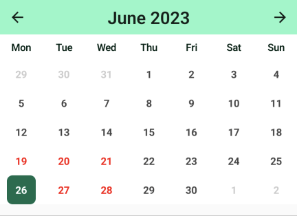
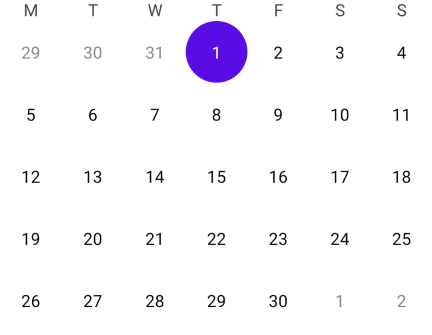
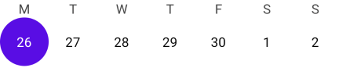

# JCalendar - calendar library

JCalendar is simple [Jetpack Compose][compose] library with plenty of modifications

You can clone this repository to try out the sample app with library implementation



## Setup

To get a Git project into your build:
### Step 1. Add the JitPack repository to your build file
Add it in your root build.gradle at the end of repositories:

	allprojects {
		repositories {
			...
			maven { url 'https://jitpack.io' }
		}
	}

### Step 2. Add the dependency

	dependencies {
	        implementation 'com.github.andrewafanasenko:jcalendar:$latest_version'
	}


## Usage

Basic implementation will look like:

```kotlin
@Composable
fun MainScreen() {
    val calendarState = rememberJCalendarState(
        startMonth = YearMonth.now(), // Can be adjusted
        endMonth = YearMonth.now(), // Can be adjusted
        firstDayOfWeek = DayOfWeek.MONDAY, // Can be adjusted
        mode = CalendarMode.MONTH // Can be adjusted
    )

    // Listening for date selection can be made in following way:
    LaunchedEffect(calendarState) {
        snapshotFlow { calendarState.selectedDate }
            .distinctUntilChanged()
            .collect {
                // Selected LocalDate will come here
            }
    }

    LaunchedEffect(calendarState) {
        snapshotFlow { calendarState.currentMonth }
            .distinctUntilChanged()
            .collect {
                // Current YearMonth will come here
            }
    }

    JCalendar(calendarState = calendarState)
}
```


If `mode == CalendarMode.MONTH` then appearance of calendar will look like: 



`JCalendar` composable function can take following arguments:

```kotlin
@Composable
fun JCalendar(
    modifier: Modifier = Modifier,
    calendarState: JCalendarState = rememberJCalendarState(),
    dayContent: @Composable (Day) -> Unit = { day: Day ->
        DayContent(day) {
            calendarState.selectDay(day)
        }
    },
    outDayContent: (@Composable (Day) -> Unit)? = { day: Day ->
        DayContent(day = day, defaultTextColor = Color.Gray) {
            calendarState.selectDay(day)
        }
    },
    dayOfWeekTitleContent: (@Composable (DayOfWeek) -> Unit)? = { dayOfWeek: DayOfWeek ->
        DayOfWeekTitleContent(dayOfWeek)
    },
)
```

*`dayContent` takes `DayContent` composable function which represents month/week day and
can be customized or replaced with own function.

*`outDayContent` takes `DayContent` composable function and represents day from previous or next 
month. Can be also customized or replaced with own function. Setting of `outDayContent` will have
no effect for calendar with `CalendarMode.MONTH` mode. If `outDayContent` is set to `null` - out
days will be hidden.

*`dayOfWeekTitleContent` takes `DayOfWeekTitleContent` composable function and represents day title
(such as S (Sunday), M(Monday)...). Can be also customized or replaced with own function. If
`dayOfWeekTitleContent` is set to `null` - titles will be hidden

## Examples

Month calendar without titles

```kotlin
val calendarState = rememberJCalendarState(
    ...
    mode = CalendarMode.MONTH
)
JCalendar(
    calendarState = calendarState,
    dayOfWeekTitleContent = null
)
```


Week calendar without titles

```kotlin
val calendarState = rememberJCalendarState(
    ...
    mode = CalendarMode.WEEK
)
JCalendar(
    calendarState = calendarState,
    dayOfWeekTitleContent = null
)
```


Month calendar without out days

```kotlin
val calendarState = rememberJCalendarState(
    ...
    mode = CalendarMode.MONTH
)
JCalendar(
    calendarState = calendarState,
    outDayContent = null
)
```


Month calendar with customized days, out days, titles
```kotlin
@Composable
fun MonthCalendarWithModifiedDay() {
    var selectedMonth by remember { mutableStateOf(YearMonth.now()) }
    val currentMonth = YearMonth.now()
    val calendarState = rememberJCalendarState(
        startMonth = currentMonth.minusMonths(3),
        endMonth = currentMonth.plusMonths(3),
        mode = CalendarMode.MONTH
    )

    LaunchedEffect(calendarState) {
        snapshotFlow { calendarState.currentMonth }
            .distinctUntilChanged()
            .collect {
                selectedMonth = it
            }
    }

    val emptyDates = listOf<LocalDate>(
        LocalDate.now().minusDays(5),
        LocalDate.now().minusDays(6),
        LocalDate.now().minusDays(7),
        LocalDate.now().plusDays(1),
        LocalDate.now().plusDays(2),
        LocalDate.now().plusDays(8),
        LocalDate.now().plusDays(10),
    )

    @Composable
    fun dayModifier(day: Day) = Modifier
        .background(
            color = if (day.isSelected) {
                Color(0xFF006C4C)
            } else {
                MaterialTheme.colors.surface
            },
            shape = RoundedCornerShape(8.dp)
        )

    Column(
        modifier = Modifier.background(Color.White)
    ) {
        Box(
            modifier = Modifier
                .fillMaxWidth()
                .background(MaterialTheme.colors.secondary)
                .padding(vertical = 8.dp),
            contentAlignment = Alignment.Center
        ) {
            Text(
                text = "Month calendar with modified day",
                style = MaterialTheme.typography.h6
            )
        }
        Row(
            modifier = Modifier
                .fillMaxWidth()
                .height(56.dp)
                .padding(bottom = 8.dp)
                .background(Color(0xFF89F8C7)),
            verticalAlignment = Alignment.CenterVertically
        ) {
            IconButton(
                onClick = { calendarState.scrollBack() }
            ) {
                Icon(
                    imageVector = Icons.Default.ArrowBack,
                    contentDescription = null
                )
            }
            Text(
                modifier = Modifier.weight(1f),
                text = selectedMonth.format(DateTimeFormatter.ofPattern("MMMM yyyy")),
                style = MaterialTheme.typography.h5,
                fontWeight = FontWeight.SemiBold,
                textAlign = TextAlign.Center
            )
            IconButton(
                onClick = { calendarState.scrollForward() }
            ) {
                Icon(
                    imageVector = Icons.Default.ArrowForward,
                    contentDescription = null
                )
            }
        }

        JCalendar(
            calendarState = calendarState,
            dayContent = { day: Day ->
                DayContent(
                    day = day,
                    modifier = dayModifier(day),
                    defaultTextColor = if (emptyDates.contains(day.date)) {
                        Color.Red
                    } else {
                        Color.DarkGray
                    },
                    selectedTextColor = Color.White,
                    textStyle = TextStyle(
                        fontSize = 14.sp,
                        fontWeight = FontWeight.Bold
                    ),
                    size = 40.dp,
                    onClick = {
                        calendarState.selectDay(day)
                    }
                )
            },
            outDayContent = { day: Day ->
                DayContent(
                    day = day,
                    modifier = dayModifier(day),
                    defaultTextColor = Color.LightGray,
                    selectedTextColor = Color.White,
                    textStyle = TextStyle(
                        fontSize = 14.sp,
                        fontWeight = FontWeight.Bold
                    ),
                    size = 40.dp,
                    onClick = {
                        calendarState.selectDay(day)
                    }
                )
            },
            dayOfWeekTitleContent = { dayOfWeek: DayOfWeek ->
                DayOfWeekTitleContent(
                    dayOfWeek = dayOfWeek,
                    modifier = Modifier.padding(bottom = 8.dp),
                    dayOfWeekStyle = java.time.format.TextStyle.SHORT,
                    textColor = Color(0xFF002114),
                    textStyle = TextStyle(
                        fontSize = 14.sp,
                        fontWeight = FontWeight.SemiBold
                    )
                )
            },
        )
    }
}
```


## License
```
MIT License

Copyright (c) 2023 Andrew Afanasenko

Permission is hereby granted, free of charge, to any person obtaining a copy
of this software and associated documentation files (the "Software"), to deal
in the Software without restriction, including without limitation the rights
to use, copy, modify, merge, publish, distribute, sublicense, and/or sell
copies of the Software, and to permit persons to whom the Software is
furnished to do so, subject to the following conditions:

The above copyright notice and this permission notice shall be included in all
copies or substantial portions of the Software.

THE SOFTWARE IS PROVIDED "AS IS", WITHOUT WARRANTY OF ANY KIND, EXPRESS OR
IMPLIED, INCLUDING BUT NOT LIMITED TO THE WARRANTIES OF MERCHANTABILITY,
FITNESS FOR A PARTICULAR PURPOSE AND NONINFRINGEMENT. IN NO EVENT SHALL THE
AUTHORS OR COPYRIGHT HOLDERS BE LIABLE FOR ANY CLAIM, DAMAGES OR OTHER
LIABILITY, WHETHER IN AN ACTION OF CONTRACT, TORT OR OTHERWISE, ARISING FROM,
OUT OF OR IN CONNECTION WITH THE SOFTWARE OR THE USE OR OTHER DEALINGS IN THE
SOFTWARE.
```

[compose]: https://developer.android.com/jetpack/compose
